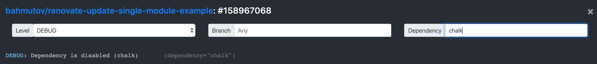

# renovate-update-single-module-example [![renovate-app badge][renovate-badge]][renovate-app] [![ci status][ci image]][ci url]
[ci image]: https://github.com/bahmutov/renovate-update-single-module-example/workflows/test/badge.svg?branch=master
[ci url]: https://github.com/bahmutov/renovate-update-single-module-example/actions
> Example repository where only a single dependency is updated using Renovate Bot

The [renovate.json](renovate.json) only allows checking updates for dependency `debug`, all other dependencies (like `chalk`) should be ignored. Here is the relevant portion of the file, we disable all updates, except for package `debug`:

```json
"packageRules": [
  {
    "packagePatterns": ["*"],
    "excludePackagePatterns": ["debug"],
    "enabled": false
  }
]
```

Renovate Bot documentation at [https://docs.renovatebot.com/](https://docs.renovatebot.com/)

You can see what Renovate does using the [Renovate Dashboard](https://app.renovatebot.com/dashboard). In the DEBUG logs you can search for a module and see if it was disabled.



[renovate-badge]: https://img.shields.io/badge/renovate-app-blue.svg
[renovate-app]: https://renovateapp.com/
